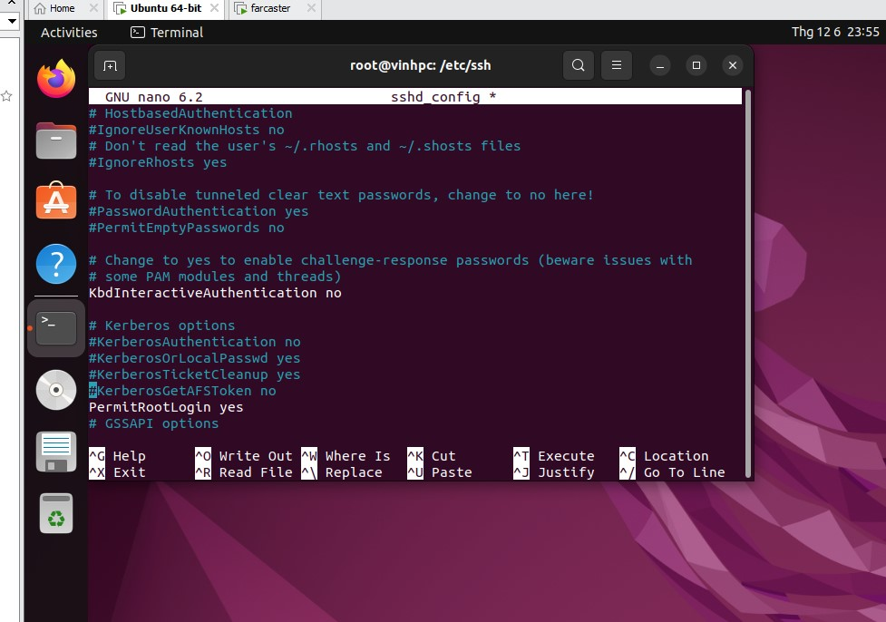
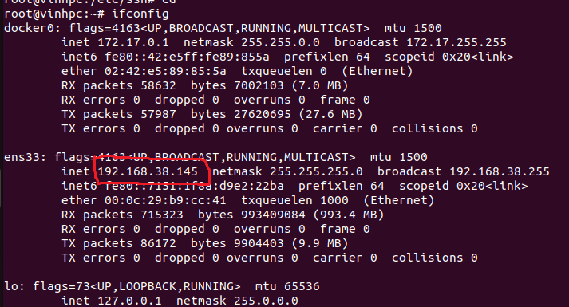
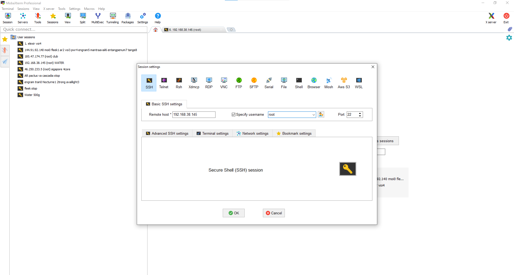

# Cài đặt 1 máy Local

## Vô quyền Root
    sudo -i

Cài ssh

    apt install openssh-server
và 

    apt install net-tools   

## Sửa ssh

cd /etc/ssh  -> nano sshd_config

Sửa như sau

thêm câu 

    PermitRootLogin yes 
Xong thì nhấn CTRL+O -> Enter -> CTRL+X
## Reset lại SSH
    systemctl restart sshd

## Lấy IP đăng nhập

    ifconfig

# Login Mobaxterm hoặc termius

# Xong